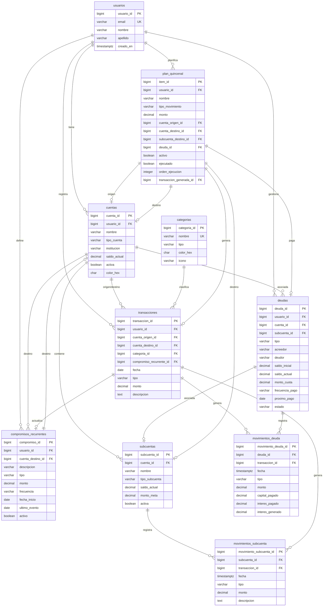

# Diagrama del Modelo de Base de Datos

## Visualización

Puedes visualizar este diagrama en:

1. **GitHub** - Este archivo se renderiza automáticamente en GitHub
2. **Mermaid Live Editor** - https://mermaid.live/
3. **VS Code** - Instala la extensión "Markdown Preview Mermaid Support"
4. **Confluence, Notion** - Soportan Mermaid nativamente

## Descripción de Relaciones Principales

### Flujo de Transacciones
- Usuario → crea → Transacción
- Transacción → afecta → Cuenta(s)
- Transacción → puede generar → Movimiento Subcuenta
- Transacción → puede generar → Movimiento Deuda

### Gestión de Deudas
- Usuario → tiene → Deudas
- Deuda → vinculada a → Cuenta
- Transacción → genera → Movimiento Deuda
- Movimiento Deuda → actualiza automáticamente → Saldo Deuda

### Compromisos Recurrentes
- Usuario → define → Compromisos Recurrentes
- Transacción → puede estar relacionada con → Compromiso
- Al crear Transacción con compromiso_id → actualiza último_evento automáticamente
- Vista calcula próximo_evento dinámicamente

### Plan Quincenal
- Usuario → crea → Items del Plan
- Item → puede ser:
  - Transferencia entre cuentas
  - Movimiento a subcuenta
  - Pago a deuda
- Al ejecutar → genera → Transacción
- Transacción → actualiza saldos automáticamente vía triggers
